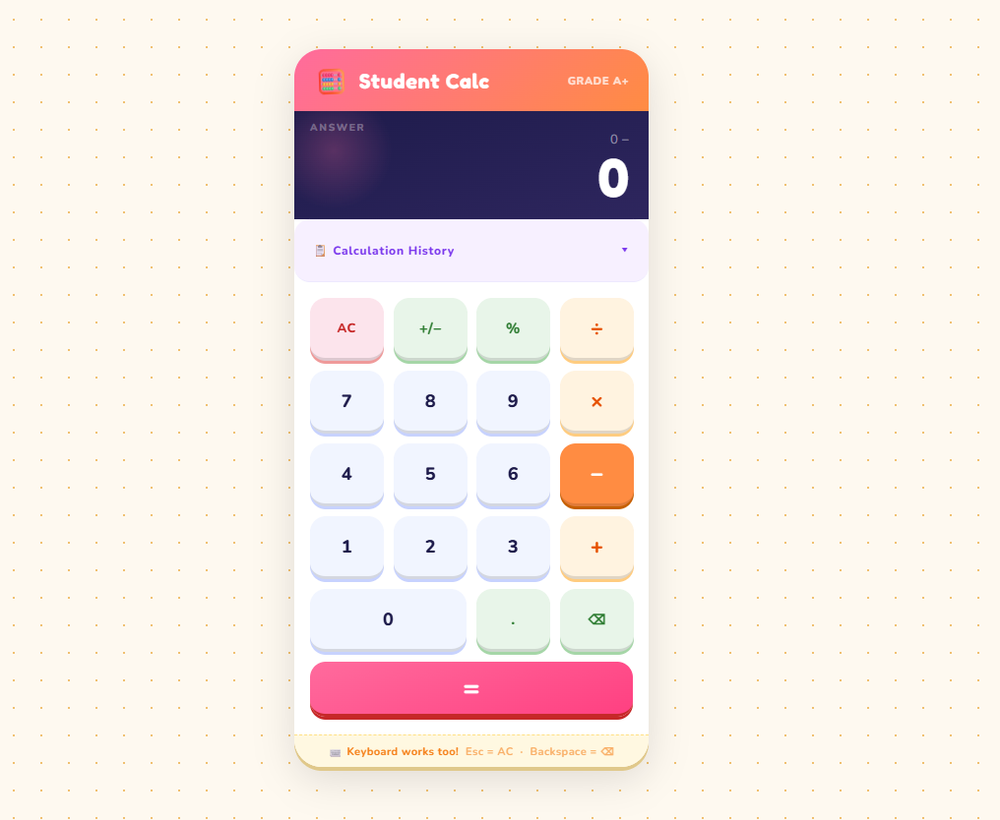

# 🧮 Student Calculator

A colorful, animated calculator built with pure HTML, CSS, and JavaScript.

## Features
- Basic arithmetic: add, subtract, multiply, divide
- Keyboard support
- Calculation history
- Percentage and sign toggle
- Zero dependencies — single HTML file

## Usage
Just open `index.html` in any browser. No installation needed.

## Live Demo
[View here](https://suvradipghosh07.github.io/student-calculator/)

## License
MIT
